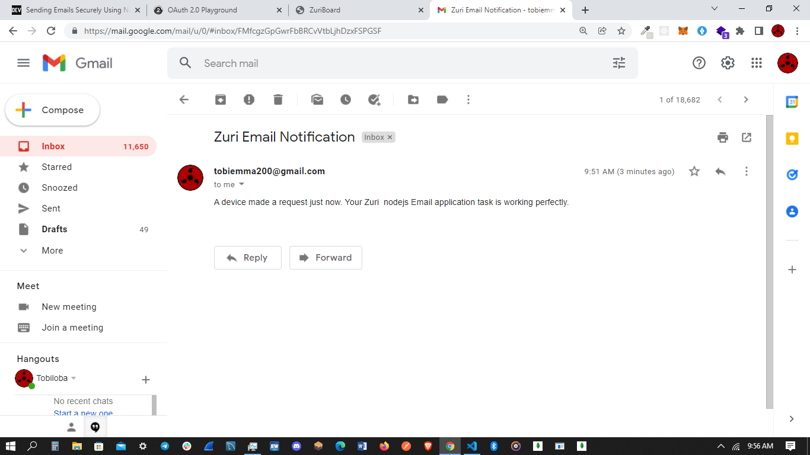

## An automated email sender 
This application sends a notification email to the owner of the application once a user enters the endpoint of the server i.e makes a request to the server. Using the nodemailer package and google OAuth2 platform , a message is sent to the owner's email once a request is made on the base url.

